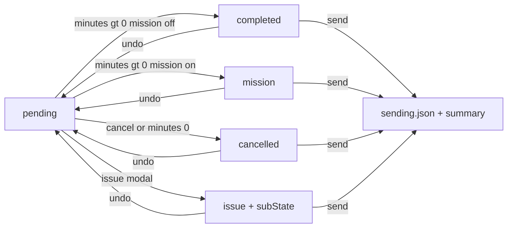

# Agent Specification: Modern Workflow (Soft Medical)

## App Overview
**Modern Workflow** is a high-focus mobile companion for anesthesiologists. It is designed for end-of-shift case documentation in a high-stress, high-glare OR environment through a "Soft Medical" aesthetic that prioritizes cognitive ease, tactile interactions, and clear review before office submission.

### Project Scope
- UI ONLY
- Exclude all API and Backend | Assume backend API and DB exists

---

## Core Behavioral Principles

### Manual Minutes Entry
Case time is entered manually, not tracked live.
- **Input:** A single numeric minutes field per case card (integers only).
- **Validation:** Whole integers only. `0` means cancelled; `> 0` means completed/mission; empty/null means pending (blocks send).
- **Auto-save:** Debounce field changes (minutes, dx, mission) like other inputs. Status re-derives live in the store unless issue-locked.

### DX-Derived Fields
- `cpt` and `eye` are derived from `dx` via lookup — never user-editable.
- When `dx` changes, store updates `dx`, `cpt`, and `eye` atomically.

---

## Content Flow
1. User: 1 Anesthesiologist
2. Case: Surgery case — patient info, diagnosis code, procedure minutes, CPT/eye (derived), optional mission flag, optional issue note
3. Workflow: **Schedule** (document + triage) → **Send to Office** (submit + summary)

---

## Data Contracts

### Input — `receiving.json`
```json
{
  "date": "01-20-2026",
  "rows": [
    {
      "pos": 1,
      "patient_id": "12345",
      "name": "LAST, FIRST",
      "dob": "1950-01-01",
      "dx": "H25.812",
      "minutes": 15,
      "cpt": "00142",
      "eye": "LEFT"
    }
  ]
}
```
- `date + patient_id` = composite case ID
- `pos` = UI sort order only
- `minutes` = suggested default, not source of truth

### Output — `sending.json`
```json
{
  "date": "01-20-2026",
  "rows": [
    {
      "patient_id": "12345",
      "status": "completed",
      "minutes": 18,
      "dx": "H25.812",
      "cpt": "00142",
      "eye": "LEFT",
      "note": ""
    },
    {
      "patient_id": "55667",
      "status": "issue",
      "sub_state": ["identity_issue", "needs_review"],
      "minutes": 15,
      "dx": "H26.9",
      "cpt": "00140",
      "eye": "LEFT",
      "note": "MRN mismatch on wristband"
    }
  ]
}
```

---

## Case State Architecture

### Persisted Status (single source of truth)
Use **one explicit persisted status** per case:
- `pending` — internal only; unresolved, blocks send
- `completed` — billable, positive minutes, mission off
- `mission` — record but don't bill; positive minutes, mission on
- `cancelled` — minutes must be `0`
- `issue` — terminal state from issue modal; issue types stored in `subState`

Issue types (`subState` entries — multi-select, not statuses):
- `identity_issue`
- `needs_review`

Do **not** derive status inside components. All derivation lives in store selectors/actions.

### Status Transitions
| From | To | Trigger |
|---|---|---|
| `pending` | `completed` | `minutes > 0` and mission off |
| `pending` | `mission` | `minutes > 0` and mission on |
| `pending` / `completed` / `mission` | `cancelled` | **Cancel** or `minutes = 0` |
| `cancelled` / `completed` / `mission` | `pending` | **Undo** (clears minutes, mission, note, subState) |
| any non-issue | `issue` | Issue modal → one or more types in `subState` |
| `issue` | `pending` | **Undo** (clears `subState`) |

**Issue status is sticky** until Undo. Minutes/mission patches do not override `issue`.

### Case Shape
```js
{
  id,              // `${date}:${patient_id}`
  date,
  pos,
  patientId,
  name,
  dob,             // YYYY-MM-DD
  dx,
  cpt,             // derived from dx
  eye,             // derived from dx
  minutes: null,   // null = pending; 0 = cancelled; > 0 = completed/mission
  mission: false,
  status,          // pending | completed | mission | cancelled | issue
  subState: [],    // IssueType[] — identity_issue | needs_review (multi-select)
  note: ''
}
```

### Triage Rules

**Minutes + mission → status (live, on patch, unless issue-locked):**
- `null` / empty → `pending`
- integer `0` → `cancelled`
- integer `> 0` + `mission` → `mission`
- integer `> 0` + `!mission` → `completed`

**Cancel (per card):**
- Visible when minutes empty or positive
- Sets `minutes = 0` → `cancelled`

**Undo (per card):**
- Visible when cancelled, issue status, or minutes === 0
- Sets `minutes = null`, `mission = false`, `note = ''`, `subState = []` → `pending`

**Issue (per card):**
- Opens modal with multi-select chips: Identity issue | Needs review (one or both)
- Optional note; submit sets `status = 'issue'` and `subState` array
- Submit disabled until at least one issue type selected
- **Edit** reopens modal on issue cards to update `subState` and note

**Send to Office (page footer)** — hard gate:
- Enabled only when every case has a terminal status (`completed`, `mission`, `cancelled`, `issue`)
- Equivalent check: `canSendToOffice(cases)`
- On success: normalize statuses, serialize to sending shape, persist, show summary modal, clear queue

---

## Store Architecture

### Raw Cases
Keep raw cases simple — `cpt`/`eye` updated in store when `dx` changes, not in components.

### Centralized Selectors / Getters
- `queueCases(cases)` — active cases sorted by `pos`
- `statusFromCaseState({ minutes, mission, issueLocked, currentStatus })` — core derivation
- `isTerminalStatus(status)` — gate helper
- `isIssueStatus(status)` — issue-lock helper
- `canSendToOffice(cases)` — every case terminal
- `sendSummary(cases)` — billable/mission/cancelled/issue counts + minute totals
- `serializeCasesForSend(cases)` — build sending.json payload

Components consume selectors only. Never filter by status in views.

### Store Actions
- `patchCase(id, fields)` — debounced updates; re-derive `cpt`/`eye` on `dx` change; re-derive status unless issue-locked
- `cancelCase(id)` — `minutes = 0`
- `undoCase(id)` — reset to `pending`
- `reportIssue(id, { subState, note })` — set status `issue`, `subState`, and note
- `sendToOffice()` — serialize, persist, return summary, clear queue

---

## App Pages

### Top-Level Pages
Primary page:
- **Schedule**

Deprecated (files retained, removed from nav):
- **Billing Review** — legacy, not part of active flow

Do not create separate top-level pages for case detail, active session, post-op, or attestation.

### Schedule Page
Documentation and submission happen here:
- Flat list of active queue (`queueCases`, sorted by `pos`)
- Each case is an editable card (see **Schedule Card Layout**)
- Per-card actions: **Cancel**, **Undo**, **Issue**
- Footer CTA: **Send to Office** (enabled via `canSendToOffice`)
- On send: summary modal, then queue cleared

### Case Card Pattern
All case interaction is inline on cards — no full-page case detail.
- Schedule cards: always show editable fields (layout below)
- Issue report uses a modal only
- No accordion, no expand/collapse — all fields visible at once

Avoid:
- Sectioned queues (Current, Needs Review, Upcoming)
- Drag-and-drop reorder
- Swipe gestures for state changes

### Card Layout Rules (global)
- Every row spans **full width** of the parent card container (`w-full`).
- Each row uses **`justify-between`** — cells align to opposite edges.
- Row children use `flex-1 min-w-0` where they must share space; truncate with ellipsis when needed.
- Schedule cards: horizontal rule (`border-t`) between content rows and the action row.

### Schedule Card Layout
```
┌────────────────────────────────────────────────────────────┐
│ [patient_id] [icon?] NAME (colored)  MM/DD/YYYY (Ny) │ min │  row 1
│ [dx ▼]  [cpt badge]  [eye badge]                           │  row 2
│ [issue type chips] (when status issue)                     │  row 2a (conditional)
│ [editable note textarea]                            [X]    │  row 2b (conditional)
├────────────────────────────────────────────────────────────┤
│ ☐ Mission                    Cancel  Undo  Issue           │  row 3
└────────────────────────────────────────────────────────────┘
```

| Row | Left | Right |
|---|---|---|
| 1 | `patient_id` badge + status icon + colored name + DOB `MM/DD/YYYY (Ny)` | Minutes input |
| 2 | DX dropdown + CPT badge + eye badge | — |
| 2a | Issue type chips from `subState` (`warning` badges) | — |
| 2b | Editable note (issue status + non-empty note only); X clears note | — |
| 3 | Mission checkbox | Cancel / Undo / Issue (Edit when issue) buttons |

**Status display (row 1 — icon + colored name):**

| Status | Color | Icon |
|---|---|---|
| `pending` | default (`text-highlighted`) | none |
| `completed` | `primary` | check (`i-lucide-check-circle-2`) |
| `mission` | `secondary` | heart (`i-lucide-heart`) |
| `cancelled` | `error` | x (`i-lucide-x-circle`) |
| `issue` | `warning` | alert (`i-lucide-circle-alert`) |

**DOB + age:** use `date-fns` (`formatDobWithAge(dob, shiftDate)`) — age computed via `differenceInYears` against case `date`, not today.

**Action visibility:**
- **Cancel** — minutes empty or positive (`error`)
- **Undo** — cancelled, issue status, or minutes === 0 (`neutral`)
- **Issue / Edit** — always visible; label **Edit** when `status === 'issue'` (`warning`)

**Note row (row 2b):** visible when `status === 'issue'` and `note` is non-empty; debounced edit via `patchCase({ note })`; X clears note.

**Implementation:** wrap each row in `flex w-full justify-between items-center`.

---

## Screen Behaviors & User Flows

### A. Schedule Page
* **Behavior:** End-of-shift documentation list for today's queue.
* **List:** Active queue sorted by `pos`.
* **Per-card fields (editable):**
  1. **Minutes** — numeric input
  2. **DX** — dropdown (drives CPT/eye)
  3. **Mission** — checkbox
* **Per-card actions:** Cancel, Undo, Issue — see **Schedule Card Layout**
* **Footer — Send to Office:**
  - Disabled unless every case is terminal (`canSendToOffice`)
  - On success: persist sending payload, show summary, clear queue



### B. Send Summary
After successful send, display:
- N cases · X billable minutes (`completed`)
- M mission cases · Y non-billable minutes (`mission`)
- C cancelled cases
- E cases with issues (`status === 'issue'`)

### C. End-to-End Shift Flow
1. Clinician opens **Schedule** — queue loaded from receiving contract.
2. For each case: confirm/edit minutes and dx; toggle mission if needed; cancel or flag issues as needed.
3. When every case is terminal, tap **Send to Office**.
4. Review summary modal; queue clears on success.

---

## Coding Guideline
1. Nuxt + JS
2. Nuxt native Vue UI controls instead of basic html components
3. Isolation & separation between View components and state logic
4. Atomic component and utilities | Avoid multi purpose components
5. All case state derivation in store selectors — never in components
6. Use **date-fns** (`differenceInYears`, `format`, `parse`) for DOB formatting and age — do not hand-roll age math

---

## Theming and Color

### Palette (calm clinical)
Defined once via Nuxt UI color aliases in `app/app.config.ts`:

| Alias | Color | Role |
|---|---|---|
| `primary` | `teal` | Positive / completed |
| `secondary` | `sky` | Mission, CPT/eye badges |
| `neutral` | `zinc` | UI chrome / surfaces |
| `warning` | `amber` | Identity issue, needs review, Issue button |

### Semantic color roles
| Role | Token | Applies to |
|---|---|---|
| Positive / completed | `primary` | Completed card accent, check icon, colored name |
| Mission | `secondary` | Mission card accent, heart icon, CPT/eye badges |
| Negative / cancelled | `error` | Cancelled card accent, x icon, Cancel button |
| Issue / review | `warning` | Identity issue / needs review accent, alert icon, Issue button |
| Neutral chrome | `neutral` | Undo, modal dismiss, note clear |

### Rules
- **Never hardcode** raw palette utilities (`slate`, `white`, `green`, `red`, `blue`). Always use Nuxt UI semantic tokens.
- Surfaces/text tokens: `bg-default`, `text-default`, `text-highlighted`, `text-muted`, `border-default`.
- Status colors are decoupled from the palette hue: use `primary` (completed), `secondary` (mission), and `error` (cancelled) so intent survives palette changes.
- The app respects system light/dark via `@nuxtjs/color-mode` (default `system` preference); every view must render correctly in both modes.

---

## Future Extensibility (Behavioral Hooks)
- **Vitals Integration:** Future behavior could include a subtle background pulse synced to a connected monitor.
- **Voice Commands:** Hands-free note entry for diagnosis or duration fields on Schedule cards.

---

## Misc / Knowledge Base

Reference docs for this stack (Nuxt 4, Vue 3, Nuxt UI):

| Topic | Link |
|---|---|
| Nuxt — getting started | https://nuxt.com/docs/getting-started/introduction |
| Nuxt — directory structure | https://nuxt.com/docs/guide/directory-structure |
| Nuxt — routing | https://nuxt.com/docs/getting-started/routing |
| Nuxt — data fetching | https://nuxt.com/docs/getting-started/data-fetching |
| Nuxt — composables | https://nuxt.com/docs/guide/directory-structure/composables |
| Nuxt UI — components | https://ui.nuxt.com/components |
| Nuxt UI — getting started | https://ui.nuxt.com/getting-started |
| Vue — guide | https://vuejs.org/guide/introduction.html |
| Vue — reactivity | https://vuejs.org/guide/essentials/reactivity-fundamentals.html |
| Vue — components | https://vuejs.org/guide/essentials/component-basics.html |
| Vue — composables | https://vuejs.org/guide/reusability/composables.html |
| Vue — script setup | https://vuejs.org/api/sfc-script-setup.html |

---

## AGENT RULES
ALL Agent responses MUST BE EXTREMELY CONCISE.
Answer ONLY yes or no where applicable
Provide bullet points for options and steps
Avoid explanations unless explicitly prompted
