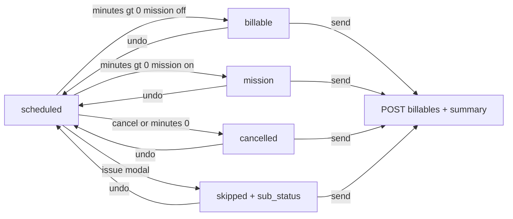

# Agent Specification: Modern Workflow (Soft Medical)

## App Overview
**Modern Workflow** is a high-focus mobile companion for anesthesiologists. It is designed for end-of-shift case documentation in a high-stress, high-glare OR environment through a "Soft Medical" aesthetic that prioritizes cognitive ease, tactile interactions, and clear review before office submission.

### Project Scope
- UI wires to the FastAPI app in `api/` for schedule load (`GET /cases/schedules`), billable submit (`POST /cases/billables`), and billing history (`GET /cases/billables`)
- Card edits (minutes, dx, mission, cancel, undo, issue) are **local in memory** until Send to Office
- UI lives under `ui/` (Nuxt app in `ui/app/`)
- API base URL from deploy/runtime `BACKEND_BASE_URL` → `runtimeConfig.public.apiBase` (via `server/plugins/backend-env.ts`; never build-time; no mock fallback)
- Optional `BACKEND_API_KEY` → `runtimeConfig.public.apiKey`; UI sends `X-API-KEY` when set; `api/` middleware validates via `CASES_DB_API_KEY` (falls back to `API_KEY`)

---

## Core Behavioral Principles

### Manual Minutes Entry
Case time is entered manually, not tracked live.
- **Input:** A single numeric minutes field per case card (integers only).
- **Validation:** Whole integers only. `0` means cancelled; `> 0` means billable/mission; empty/null means scheduled (blocks send).
- **Auto-save:** Debounce field changes (minutes, dx, note) like other inputs. Status re-derives live in local queue unless issue-locked.

### DX-Derived Fields
- `cpt` and `eye` are derived from `dx` via lookup — never user-editable.
- When `dx` changes, local queue updates `dx`, `cpt`, and `eye` atomically.

### Mission Checkbox (UI-only)
- `mission: boolean` is a **UI-only** field on the local case model — not sent to API as a separate field.
- Checkbox calls `setMission()`; `status = 'mission'` only when `mission = true` **and** `minutes > 0`.
- Mission checkbox on with empty minutes → status stays `scheduled`.

---

## Content Flow
1. User: 1 Anesthesiologist
2. Case: Surgery case — patient info, diagnosis code, procedure minutes, CPT/eye (derived), optional mission flag, optional issue note
3. Workflow: **Schedule** (document + triage) → **Send to Office** (submit + summary)

---

## Data Contracts

### Input — `GET /cases/schedules` → `CaseInfo[]`
```json
[
  {
    "case_id": "9a804f13-5a70-58f6-9a02-d3662c99013a",
    "service_date": "2026-01-20",
    "case_pos": 1,
    "patient_id": "12345",
    "patient_name": "LAST, FIRST",
    "patient_dob": "1950-01-01",
    "dx": "H25.812",
    "cpt": "00142",
    "eye": "LEFT",
    "minutes": 15,
    "status": "scheduled"
  }
]
```
- `case_id` = UUID primary key
- `case_pos` = UI sort order only
- `minutes` = suggested default on load, not source of truth until documented
- UI adds `mission: false` on load for checkbox default

### Output — `POST /cases/billables` → `CaseInfo[]`
```json
[
  {
    "case_id": "9a804f13-5a70-58f6-9a02-d3662c99013a",
    "service_date": "2026-01-20",
    "case_pos": 1,
    "patient_id": "12345",
    "patient_name": "LAST, FIRST",
    "patient_dob": "1950-01-01",
    "dx": "H25.812",
    "cpt": "00142",
    "eye": "LEFT",
    "minutes": 18,
    "status": "billable",
    "note": ""
  },
  {
    "case_id": "41586259-f4b2-5439-bf5d-e7a27f47157d",
    "service_date": "2026-01-20",
    "case_pos": 5,
    "patient_id": "55667",
    "patient_name": "CHEN, WEI",
    "patient_dob": "1971-04-30",
    "dx": "H26.9",
    "cpt": "00140",
    "eye": "LEFT",
    "minutes": 15,
    "status": "skipped",
    "sub_status": ["identity_issue"],
    "note": "MRN mismatch on wristband"
  }
]
```

### Response — `BillableCasesSubmissionResponse`
```json
{
  "billable": ["uuid-1"],
  "mission": ["uuid-2"],
  "cancelled": ["uuid-3"],
  "issues": ["uuid-4", "uuid-5"]
}
```
Summary modal counts from response arrays; minute totals from local cases before send.

---

## Case State Architecture

### Persisted Status (single source of truth)
Use **one explicit status** per case:
- `scheduled` — unresolved; blocks send (`minutes` null/empty, or not yet terminal)
- `billable` — terminal; `minutes > 0`, mission checkbox off
- `mission` — terminal; `minutes > 0`, mission checkbox on
- `cancelled` — terminal; `minutes === 0`
- `skipped` — terminal; sticky; `sub_status` holds issue types; minutes may be null or positive

Issue types (`sub_status` entries — multi-select, not statuses):
- `identity_issue`
- `needs_review`

Do **not** derive status inside components. All derivation lives in `caseSelectors.js` / `useCaseQueue`.

### Status Transitions
| From | To | Trigger |
|---|---|---|
| `scheduled` | `billable` | `minutes > 0` and mission off |
| `scheduled` | `mission` | `minutes > 0` and mission on |
| `scheduled` / `billable` / `mission` | `cancelled` | **Cancel** or `minutes = 0` |
| `cancelled` / `billable` / `mission` | `scheduled` | **Undo** (clears minutes, mission, note, sub_status) |
| any non-skipped | `skipped` | Issue modal → one or more types in `sub_status` |
| `skipped` | `scheduled` | **Undo** (clears `sub_status`) |

**Skipped status is sticky** until Undo. Minutes/mission patches do not override `skipped`.

### Case Shape
```js
{
  case_id,           // UUID
  facility_id,       // optional API field
  provider_id,       // optional API field
  service_date,      // YYYY-MM-DD
  service_time,      // optional HH:MM
  case_pos,
  patient_id,
  patient_name,
  patient_dob,       // YYYY-MM-DD
  dx,
  cpt,               // derived from dx
  eye,               // derived from dx
  minutes: null,     // null = scheduled; 0 = cancelled; > 0 = billable/mission
  mission: false,    // UI-only checkbox flag
  status,            // scheduled | billable | mission | cancelled | skipped
  sub_status: [],    // IssueType[] — identity_issue | needs_review (multi-select)
  note: ''
}
```

### Triage Rules

**Minutes + mission → status (live, on local update, unless issue-locked):**
- `status === 'skipped'` (issue-locked) → `skipped`
- `minutes === 0` → `cancelled`
- `minutes` null / empty / invalid → `scheduled` (even if mission checkbox on)
- `minutes > 0` + mission on → `mission`
- `minutes > 0` + mission off → `billable`

**Cancel (per card):**
- Visible when minutes empty or positive (not skipped)
- Sets `minutes = 0`, `mission = false` → `cancelled`

**Undo (per card):**
- Visible when cancelled, skipped status, or minutes === 0
- Sets `minutes = null`, `mission = false`, `note = ''`, `sub_status = []` → `scheduled`

**Issue (per card):**
- Opens modal with multi-select chips: Identity issue | Needs review (one or both)
- Optional note; submit sets `status = 'skipped'` and `sub_status` array; minutes unchanged
- Submit disabled until at least one issue type selected

**Send to Office (page footer)** — hard gate:
- Enabled only when every case has a terminal status (`billable`, `mission`, `cancelled`, `skipped`)
- Equivalent check: `canSendToOffice(cases)`
- On success: `serializeCasesForBillables()`, POST to API, show summary modal, reload queue

---

## Store Architecture

### Local Queue (`useCaseQueue`)
In-memory case queue — no per-action HTTP round-trips:
- `loadQueue()` — `GET /cases/schedules` via `useCaseApi`
- `updateCase(case_id, fields)` — merge dx/minutes/note; re-derive cpt/eye and status unless issue-locked
- `setMission(case_id, checked)` — set UI-only mission flag; re-derive status
- `cancelCase(case_id)` — `minutes = 0`, `mission = false`, `status = 'cancelled'`
- `undoCase(case_id)` — reset to `scheduled`
- `reportIssue(case_id, { sub_status, note })` — set `status = 'skipped'`
- `sendToOffice()` — serialize, POST, clear queue

### HTTP API (`useCaseApi`)
- `getCases()` → `GET ${apiBase}/cases/schedules`
- `sendToOffice(cases)` → `POST ${apiBase}/cases/billables`
- `apiBase` from runtime `BACKEND_BASE_URL` (never baked at build)

### Billing API (`useBillingApi`)
- `getBillingSummaries()` → `GET ${apiBase}/cases/billables`
- Aggregates via `billingSelectors.js` into `BillingDaySummary[]` (group by `service_date`, newest-first)

### Centralized Selectors (`caseSelectors.js`)
- `queueCases(cases)` — active cases sorted by `case_pos`
- `statusFromCaseState({ minutes, mission, issueLocked, currentStatus })` — core derivation
- `isTerminalStatus(status)` — gate helper
- `isIssueStatus(status)` — issue-lock helper
- `canSendToOffice(cases)` — every case terminal
- `sendSummary(cases)` — billable/mission/cancelled/skipped counts + minute totals
- `serializeCasesForBillables(cases)` — build `CaseInfo[]` POST body (omits UI-only `mission`)

### Billing Selectors (`billingSelectors.js`)
- `billingSummariesFromResponse(response)` — aggregate billable cases into day summaries

Components consume selectors only. Never filter by status in views.

---

## App Pages

### Top-Level Pages
Primary pages:
- **Schedule** — document + Send to Office
- **Billing** — history from `GET /cases/billables` (aggregated day cards)

Deprecated (files retained, removed from nav):
- **Billing Review** — legacy alias; redirects to Billing

Do not create separate top-level pages for case detail, active session, post-op, or attestation.

### Schedule Page
Documentation and submission happen here:
- Flat list of active queue (`queueCases`, sorted by `case_pos`)
- Each case is an editable card (see **Schedule Card Layout**)
- Per-card actions: **Cancel**, **Undo**, **Issue**
- Footer CTA: **Send to Office** (enabled via `canSendToOffice`)
- On send: summary modal, then queue reloaded from API

### Case Card Pattern
All case interaction is inline on cards — no full-page case detail.
- Schedule cards: always show editable fields (layout below)
- Issue report uses a modal only
- No accordion, no expand/collapse — all fields visible at once

Avoid:
- Sectioned queues (Current, Needs Review, Upcoming)
- Drag-and-drop reorder
- Swipe gestures for state changes

### Card Layout Rules (global)
- Every row spans **full width** of the parent card container (`w-full`).
- Each row uses **`justify-between`** — cells align to opposite edges.
- Row children use `flex-1 min-w-0` where they must share space; truncate with ellipsis when needed.
- Schedule cards: horizontal rule (`border-t`) between content rows and the action row.

### Schedule Card Layout
```
┌────────────────────────────────────────────────────────────┐
│ [patient_id] [icon?] NAME (colored)  MM/DD/YYYY (Ny) │ min │  row 1
│ [dx ▼]  [cpt badge]  [eye badge]                           │  row 2
│ [issue type chips] (when status skipped)                     │  row 2a (conditional)
│ [editable note textarea]                            [X]    │  row 2b (conditional)
├────────────────────────────────────────────────────────────┤
│ ☐ Mission                    Cancel  Undo  Issue           │  row 3
└────────────────────────────────────────────────────────────┘
```

| Row | Left | Right |
|---|---|---|
| 1 | `patient_id` badge + status icon + colored name + DOB `MM/DD/YYYY (Ny)` | Minutes input |
| 2 | DX dropdown + CPT badge + eye badge | — |
| 2a | Issue type chips from `sub_status` (`warning` badges) | — |
| 2b | Editable note (skipped status + non-empty note only); X clears note | — |
| 3 | Mission checkbox | Cancel / Undo / Issue buttons |

**Status display (row 1 — icon + colored name):**

| Status | Color | Icon |
|---|---|---|
| `scheduled` | default (`text-highlighted`) | none |
| `billable` | `primary` | check (`i-lucide-check-circle-2`) |
| `mission` | `secondary` | heart (`i-lucide-heart`) |
| `cancelled` | `error` | x (`i-lucide-x-circle`) |
| `skipped` | `warning` | alert (`i-lucide-circle-alert`) |

**DOB + age:** use `date-fns` (`formatDobWithAge(patient_dob, service_date)`) — age computed via `differenceInYears` against `service_date`, not today.

**Action visibility:**
- **Cancel** — minutes empty or positive, not skipped (`error`)
- **Undo** — cancelled, skipped status, or minutes === 0 (`neutral`)
- **Issue** — visible when not cancelled and not skipped (`warning`)

**Note row (row 2b):** visible when `status === 'skipped'` and `note` is non-empty; debounced edit via `updateCase({ note })`; X clears note.

**Implementation:** wrap each row in `flex w-full justify-between items-center`.

---

## Screen Behaviors & User Flows

### A. Schedule Page
* **Behavior:** End-of-shift documentation list for today's queue.
* **List:** Active queue sorted by `case_pos`.
* **Per-card fields (editable):**
  1. **Minutes** — numeric input
  2. **DX** — dropdown (drives CPT/eye)
  3. **Mission** — checkbox (UI-only `mission` flag)
* **Per-card actions:** Cancel, Undo, Issue — see **Schedule Card Layout**
* **Footer — Send to Office:**
  - Disabled unless every case is terminal (`canSendToOffice`)
  - On success: POST billables payload, show summary, reload queue



### B. Send Summary
After successful send, display:
- N billable cases (`billable` count from API response)
- M mission cases (`mission` count from API response)
- C cancelled cases (`cancelled` count from API response)
- E skipped cases (`issues` count from API response)

### C. End-to-End Shift Flow
1. Clinician opens **Schedule** — queue loaded from `GET /cases/schedules`.
2. For each case: confirm/edit minutes and dx; toggle mission if needed; cancel or flag issues as needed.
3. When every case is terminal, tap **Send to Office**.
4. Review summary modal; queue reloads from API on success.

---

## Coding Guideline
1. Nuxt + JS
2. Nuxt native Vue UI controls instead of basic html components
3. Isolation & separation between View components and state logic
4. Atomic component and utilities | Avoid multi purpose components
5. All case state derivation in `caseSelectors.js` — never in components
6. Use **date-fns** (`differenceInYears`, `format`, `parse`) for DOB formatting and age — do not hand-roll age math
7. `service_date` uses ISO `YYYY-MM-DD` format throughout
8. For `api/` Python code: use `api/.venv` for modules and execution (`api/.venv/bin/python`, `api/.venv/bin/pytest`, etc.)

---

## Theming and Color

### Palette (calm clinical)
Defined once via Nuxt UI color aliases in `ui/app/app.config.ts`:

| Alias | Color | Role |
|---|---|---|
| `primary` | `teal` | Positive / billable |
| `secondary` | `sky` | Mission, CPT/eye badges |
| `neutral` | `zinc` | UI chrome / surfaces |
| `warning` | `amber` | Identity issue, needs review, Issue button |

### Semantic color roles
| Role | Token | Applies to |
|---|---|---|
| Positive / billable | `primary` | Billable card accent, check icon, colored name |
| Mission | `secondary` | Mission card accent, heart icon, CPT/eye badges |
| Negative / cancelled | `error` | Cancelled card accent, x icon, Cancel button |
| Issue / review | `warning` | Identity issue / needs review accent, alert icon, Issue button |
| Neutral chrome | `neutral` | Undo, modal dismiss, note clear |

### Rules
- **Never hardcode** raw palette utilities (`slate`, `white`, `green`, `red`, `blue`). Always use Nuxt UI semantic tokens.
- Surfaces/text tokens: `bg-default`, `text-default`, `text-highlighted`, `text-muted`, `border-default`.
- Status colors are decoupled from the palette hue: use `primary` (billable), `secondary` (mission), and `error` (cancelled) so intent survives palette changes.
- The app respects system light/dark via `@nuxtjs/color-mode` (default `system` preference); every view must render correctly in both modes.

---

## Future Extensibility (Behavioral Hooks)
- **Vitals Integration:** Future behavior could include a subtle background pulse synced to a connected monitor.
- **Voice Commands:** Hands-free note entry for diagnosis or minutes fields on Schedule cards.

---

## Misc / Knowledge Base

Reference docs for this stack (Nuxt 4, Vue 3, Nuxt UI):

| Topic | Link |
|---|---|
| Nuxt — getting started | https://nuxt.com/docs/getting-started/introduction |
| Nuxt — directory structure | https://nuxt.com/docs/guide/directory-structure |
| Nuxt — routing | https://nuxt.com/docs/getting-started/routing |
| Nuxt — data fetching | https://nuxt.com/docs/getting-started/data-fetching |
| Nuxt — composables | https://nuxt.com/docs/guide/directory-structure/composables |
| Nuxt UI — components | https://ui.nuxt.com/components |
| Nuxt UI — getting started | https://ui.nuxt.com/getting-started |
| Vue — guide | https://vuejs.org/guide/introduction.html |
| Vue — reactivity | https://vuejs.org/guide/essentials/reactivity-fundamentals.html |
| Vue — components | https://vuejs.org/guide/essentials/component-basics.html |
| Vue — composables | https://vuejs.org/guide/reusability/composables.html |
| Vue — script setup | https://vuejs.org/api/sfc-script-setup.html |

---

## AGENT RULES
- ALL Agent responses MUST BE EXTREMELY CONCISE.
- Answer ONLY yes or no where applicable
- Provide bullet points for options and steps
- Avoid explanations unless explicitly prompted
- **Do only what was explicitly prompted.** No unsolicited refactors, renames, cleanups, drive-by edits, dependency bumps, formatting sweeps, or “while I’m here” changes.
- **No git operations unless explicitly prompted** — no `commit`, `push`, `add`, `checkout`, `restore`, `reset`, `rebase`, `merge`, branch create/delete, or PR create/update. If unclear whether git was requested, ask first and do nothing.
- NEVER make git commit or push unless explicitly prompted
- When instructed to apply a specific pattern (e.g., "add cursor"), apply ONLY that pattern.
- Never rename, rewrite, or restructure existing working code unless explicitly asked.
- Never use `git checkout`, `git restore`, or `git reset` to fix mistakes — use targeted edits.
- Minimize diff size. If the instruction is one line, the diff should be ~one line.
- Touch only files required by the prompt. Prefer the smallest possible patch.
